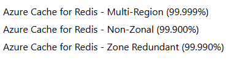

# Microsoft Cloud Platform Composite Availability Target Estimation (CATE) tool

Important notes:

- This tool assists in calculating an estimated composite availability target for a given set of critical flows through an application workload.
- The calculated estimate is intended to be used as a rough-order-of-magnitude (ROM) estimate for the general availability of a workload based on the design and dependency chain of each critical flow.
- While the calculated estimate is based on Microsoft published Service Level Agreements (SLAs) for individual cloud services, this composite estimate does not represent a financially backed SLA guarantee and not eligible for Service Credits.
- Individual service SLAs are summarized on the SLA worksheet tab for easy reference.  Full SLA definitions can be referenced
- Some services are already zonal by design - for example Standard Load Balancers - do not set the "Zonal" flag to 1, 2 or 3 zones for these as the availability for these services will not increase with that.

Usage:

1. This tool should be used for evaluating critical flows through an application. Each flow should be handled separately.
2. Other than the first column, the titles of each column are there as examples and are a way to group like resources together to reflect the design of the critical application flow. Each column, other than the first one, behaves in exactly the same fashion and can be used as needed for the flow you are analyzing.
3. In each grouping of services, select the cloud services used for that step in the critical application flow.
4. At the bottom of each group, select the flags based on how these services are deployed and leveraged in the critical application flow.

 | Option | Detail                                                                                |
 | :----- | :------------------------------------------------------------------------------------ |
 | Deployment to # of Zones | Select "No" for deployments not explicitly pinned to one or more Zones, or # of Zones for zonal deployments that are explicitly pinned to one or more Zones. |
 |        | Many Platform as a Service (PaaS) resources have their own adjusted SLA value for being zone-redundant. **If one of these services is chosen, do NOT set the number of zones** as the SLA already takes this into account. In the example below for Azure Cache for Redis, you can see the SLA difference between non-zonal and zone redundant. |
 |        |  |
 | AND/OR | If all services must be available in that group, select AND.  If only one of the services must be available, select OR. For example, if there is a database and also a cache and only one the two needs to be up for the flow to be successful, that is an OR. |
 | Multiple Region Deployment | If group is deployed to multiple Azure regions, select YES.  If using Active / Passive BCDR approach across multiple regions, note that RTO must be achievable within the "Projected Downtime" to attribute to an improved availability target. Also note from the graphic above that some services have entries specific to being multi-zone. If this is the case, choose No. |
